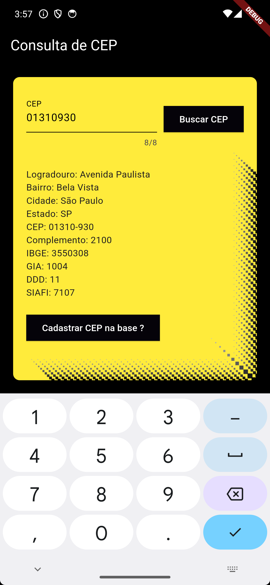
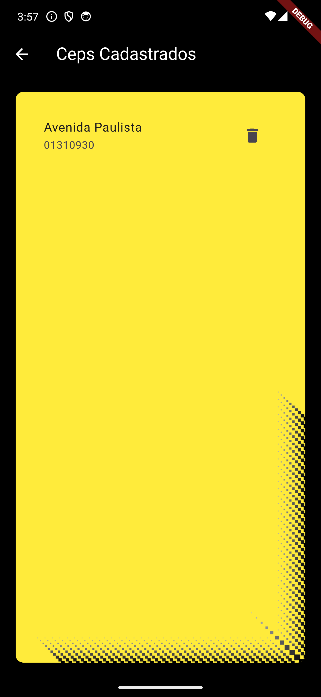
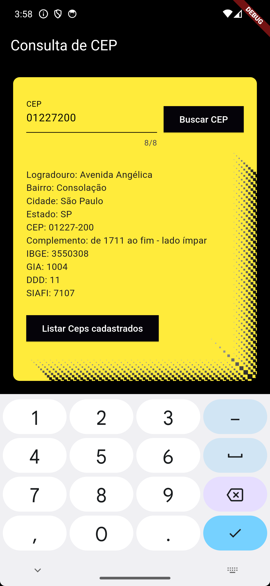

# Projeto Consulta CEP

Este projeto é um aplicativo Flutter que permite ao usuário consultar CEPs através da API ViaCep. Além disso, o aplicativo verifica se o CEP consultado já existe em um banco de dados local. Se o CEP não existir no banco de dados, o aplicativo exibe um botão para permitir ao usuário cadastrar o CEP. Se o CEP já existir no banco de dados, o aplicativo exibe um botão para permitir ao usuário consultar os CEPs já pesquisados e cadastrados.

O aplicativo utiliza o Back4App, um banco de dados NoSQL, para realizar os cadastros de CEP.

### Funcionalidades
- Consulta de CEPs através da API ViaCep
- Verificação de existência do CEP em um banco de dados local
- Cadastro de novos CEPs no banco de dados
- Consulta de CEPs já pesquisados e cadastrados

### Screenshots
<p float="left">
  
   
   
   
   
</p>

### Como usar
Clone este repositório
```
```

Navegue até a pasta do projeto
```
cd 
```

Execute flutter pub get para instalar as dependências
```
flutter pub get
```

Execute flutter run para iniciar o aplicativo
```
flutter run
```

### Dependências
- Flutter SDK
- cupertino_icons: ^1.0.6
- http: ^1.2.1
- Back4App

### Desenvolvimento
Este projeto foi desenvolvido com o Flutter, um framework de código aberto para desenvolvimento de aplicativos móveis. Ele usa a API ViaCep para consultar CEPs e o Back4App, um banco de dados NoSQL, para armazenar os CEPs consultados.

### Contribuições
Contribuições são bem-vindas! Sinta-se à vontade para abrir uma issue ou enviar um pull request.
